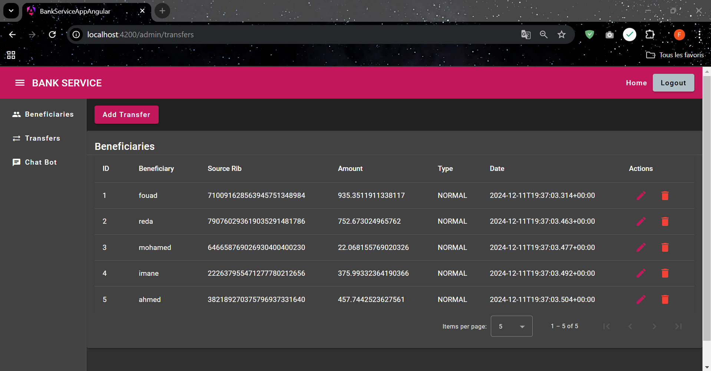

# BANK SERVICE ANGULAR APP

* check backend with microservices spring boot : https://github.com/fouad-saidi-dev/bank-service-spring-cloud

## BANK SERVICE MANAGEMENT :

### GET BENEFICIARIES :

### GET TRANSFERS OF BENEFICIARY :

### ADD BENEFICIARY :

### AFTER ADDING BENEFICIARY :

### EDIT BENEFICIARY :

### AFTER EDITING BENEFICIARY :

### GET ALL TRANSFERS :

### CHAT-BOT :

